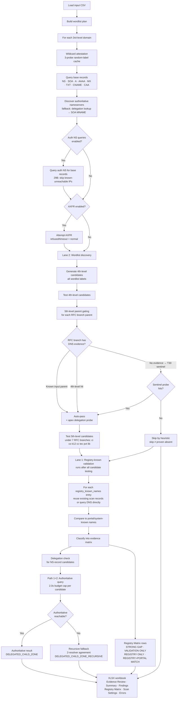

# .US Locality DNS Discovery Tool

Internal-use **standalone Windows desktop utility** (Python 3.11+, tested on 3.14.6) for **unknown child domain discovery** under known 3rd-level `.us` domains from your system.

**Plain-language goal:** use this tool to scan known 3rd-level `.us` domains from our system and look for **child DNS names beneath them that are not already known in the system**.

**What this tool does:** compares known child domains from your input against child DNS names found by live DNS testing, then exports a workbook for human review. It also validates **registry-known names** against live DNS and your system view to surface names that exist in the registry and DNS but may be missing from your portal — the **registry evidence matrix**.

**What this tool cannot prove:** absence of discovered child names is **not** proof that no child domains exist. The tool does not perform complete zone enumeration, passive DNS, OSINT, or web scraping. A few good new examples may be enough for the business question.

## Operator quick-start

1. Open `USLocalityDNSDiscovery.exe` (or run `python app.py` from source).
2. Select a `.txt` or `.csv` file with known 3rd-level domains (recommended enriched CSV below).
3. Choose **Light Evidence** for a first 10–25 domain sample (default).
4. Review **Preflight Summary** (selected domain column, first domains, profile, candidate estimate).
5. Click **Run Scan** and watch the **phase/progress** text.
6. Click **Export Results** → **XLSX workbook (recommended)**.
7. Open **Evidence Review** first (sorted Strong → Moderate → Limited → etc.).
8. Read the **Why** column for plain-English context; use **How to Read** for definitions.
9. Review `new_child_domains_found`, `evidence_value`, and **Verification guidance** (XLSX) / `manual_verification_hint` (CSV/JSON).
10. Use optional dig commands from Verification guidance for independent confirmation when helpful.
11. If your input included a `registry_known_names` column, open the **Registry Matrix** sheet to review the registry-vs-DNS-vs-portal evidence rows; focus on **STRONG GAP** entries first.

## How the scan works (flowchart)



**Flowchart nodes verified against `scan_engine.py`:**
- Lane 2 (wordlist discovery) runs first; Lane 1 (registry-known validation) is the last step of each domain scan — not parallel.
- Wildcard attestation uses 3 random-label probes; the result is cached per parent throughout the scan.
- RFC branch parent gating (T30): branches with no 4th-level DNS evidence receive a tiered sentinel probe (Tiers 2–4) before being opened or skipped by heuristic; a heuristic skip is not evidence of absence.
- Delegation check: Path 1/2 are authoritative queries capped at 2.0 s per candidate; Path 3 (recursive fallback, 2-resolver agreement) fires when authoritative is unreachable and is not subject to the cap.
- There is no quota gate in this tool.

## Current status

This version is **mission-complete** (v0.25.0, source commit `a71f6ad`, packaged build verified). It includes:

- **Registry evidence matrix (Lane 1)** — validates registry-known names against live DNS and your portal/system view; surfaces strong-gap rows in the XLSX Registry Matrix sheet.
- **Two-lane evidence model** — Lane 1 (registry-known validation) and Lane 2 (wordlist candidate discovery) produce separate, labelled rows in the workbook.
- **7 RFC branch 5th-level probing** — `ci`, `co`, `k12`, `cc`, `tec`, `pvt`, `lib`.
- **Progressive RFC branch escalation (T30)** — sentinel probe before deciding to skip an untested branch.
- **Recursive delegation fallback (D2)** — when authoritative NS is unreachable, a 2-resolver recursive agreement confirms delegated child zones.
- **NODATA parent-authority classification (T32)** — NOERROR + no answer + parent SOA in authority is classified as in-zone but not delegated; skipping deeper names in this state is not proof of absence.
- **Wall-clock budget cap (29C)** — authoritative delegation verifier is capped at 2.0 s per candidate; recursive fallback runs outside the cap.
- **Auth-NS unreachable short-circuit (29B)** — per-run cache of unreachable nameserver IPs.
- Full Tkinter desktop GUI with threaded scan, phase/progress display, cancel, and partial-result export.

## Evidence model (workbook)

| Field | Meaning |
|-------|---------|
| `known_domain` | `yes` / `no` — was this discovered name already listed in the input known-child fields? |
| `name_type` | `delegated_child_zone`, `organizational_child_name`, `service_hostname`, `generic_hostname`, `technical_vendor_hostname`, etc. |
| `evidence_value` | `strong`, `moderate`, `limited`, `validation_only`, `context_only`, `none`, `inconclusive` |
| `new_child_domains_found` | Child DNS names found in live DNS that were **not** already known in the system input |
| `known_domains_validated` | Known child domains from input that were confirmed in live DNS |

**How to read names:**

- `www`, `mail`, `autodiscover`, `smtp`, `msoid`, `lyncdiscover` are valid DNS child names but usually **limited** evidence value.
- `police`, `portal`, `library`, `court`, `fire`, etc. are more meaningful organizational examples (**moderate** when new).
- NS/SOA delegated child zones not already known in the system are **strong** evidence.

## Registry evidence matrix (Lane 1)

The registry matrix is the mission-critical evidence output. It compares:

| Column | What it means |
|--------|---------------|
| **Registry known** | Name supplied in the `registry_known_names` input column — authoritative registry view |
| **DNS status** | Whether the name resolves in live DNS (confirmed / not confirmed) |
| **Portal status** | Whether the name appears in your system/portal input (`known_fourth_level_domains`) |
| **Matrix cell** | Combined classification (see below) |

**Matrix cells:**

| Cell | Registry | DNS | Portal | Meaning |
|------|----------|-----|--------|---------|
| **STRONG GAP** | Present | Live | Missing | Registry and DNS agree the name exists; your portal does not show it. **Review these rows first.** |
| **VALIDATION ONLY** | Present | Live | Present | Registry and DNS agree; portal already knows it. Informational. |
| **REGISTRY ONLY** | Present | Not confirmed | Either | Registry lists it but DNS does not currently resolve it. May warrant follow-up. |
| **REGISTRY + PORTAL MATCH** | Present | Not confirmed | Present | Appears in both registry and portal but DNS does not currently confirm it. |

**STRONG GAP caveat:** the portal-status column is only as accurate as the data you supply in `known_fourth_level_domains`. Before presenting STRONG GAP rows as proof of a visibility gap, confirm that your portal export is complete for the scanned domain. A STRONG GAP row means: the registry listed it, DNS confirmed it, and it was not in your input — but if your input was incomplete, it may already be in your portal.

**How to populate registry-known names:** add a `registry_known_names` column to your enriched CSV with semicolon-separated names (e.g. `pvt.k12.pa.us;fcs.pvt.k12.pa.us`). The Registry Matrix sheet is only produced when this column is present and non-empty.

## Scan profiles

| Profile | Purpose | Sources | ~Candidates/domain | Typical batch |
|---------|---------|---------|-------------------|---------------|
| **Light Evidence** | Fast first pass; 25 high-value labels; no 5th-level | `light_evidence.txt` only | ~25 | 25–50 domains |
| **Normal Evidence** | RFC + Common + Civic wordlists; 5th-level enabled | RFC + Common + Civic | ~1,118 | 3–10 domains |
| **Deep Targeted** | Same built-in sources as Normal; enables additional controls for custom wordlist | RFC + Common + Civic + optional custom | ~1,118+ | 1–3 domains |

Light Evidence is the recommended first run for a pilot sample. Do not run all ~2,000 domains unless intentionally planned.

The candidate estimate for Normal/Deep breaks down as: 152 unique labels (4th-level) + 138 prefix labels × 7 RFC branches (5th-level) = 152 + 966 = ~1,118 per domain.

## Wordlist sources

Built-in wordlists are editable one-label-per-line text files under `wordlists/`:

| File | GUI label | Profile default |
|------|-----------|-----------------|
| `light_evidence.txt` | Light Evidence labels | **On** (Light profile only) |
| `rfc1480.txt` | RFC/locality baseline | **On** (Normal / Deep) |
| `dns_common.txt` | Common DNS/web labels | **On** (Normal / Deep) |
| `civic_departments.txt` | Civic departments | **On** (Normal / Deep) |
| `public_services.txt` | Public services / portals | Off |
| `schools_libraries.txt` | Schools / libraries | Off |

**Custom wordlist:** browse for a `.txt` or `.csv` file, then use **Include custom wordlist** to control whether it is merged into the scan. The scan log always shows which sources were included.

Before scanning, the log reports:

- Label count per selected source
- Total unique candidate labels (deduplicated across sources)
- Estimated candidate names per base domain (4th-level + 5th-level under 7 RFC branches when enabled)
- Whether 5th-level generation is enabled
- Warnings when candidate estimates exceed 250 or 500

Selected wordlists are **not complete** — they are starting points for discovery only.

## How to choose wordlist sources

- **Light Evidence labels** — the Light profile's dedicated file; fast, no 5th-level. Use for first-pass batches.
- **RFC/locality baseline** — start here for Normal/Deep; enables 5th-level generation under all 7 RFC branches.
- **Common DNS/web labels** — adds typical hostnames (`www`, `mail`, `ns1`, etc.); good for normal batches.
- **Civic departments** — department-style labels; use for normal evidence scans.
- **Public services / Schools** — broader label sets; reserve for deep scans on small domain counts.
- **Custom wordlist** — browse for a `.txt` or `.csv` file, then check **Include custom wordlist**.

Turn off sources you do not need to reduce scan time and noise.

## Recommended batch sizes

Plan smaller batches for deeper wordlist coverage. For a full locality list (~157 external-DM domains), run multiple batches rather than one very-large scan.

| Batch type | Domains | Suggested wordlist sources |
|------------|---------|----------------------------|
| **Light scan** | 25–50 | Light Evidence labels only |
| **Normal evidence scan** | 3–10 | RFC/locality baseline + Common DNS/web labels + Civic departments |
| **Deep scan** | 1–3 | Add Public services, Schools/libraries, and/or a custom wordlist |

Higher candidate counts mean longer run times. The preflight summary shows estimated candidates per domain and a scan-size label (`small`, `moderate`, `large`, `very large`) with operator guidance. Confirm before starting when totals reach 10,000+ or 50,000+ candidates.

## Recommended Evidence Workflow

Use this workflow for coworker-ready visibility-gap evidence from a **small targeted sample**, not the full ~2,000-domain list:

1. Start with a **small enriched CSV sample** exported from your spreadsheet (not the full list).
2. Prefer **3–10 actual externally managed 3rd-level domains** for the first run.
3. Include a **mix of Delegated Managers** when possible.
4. If you have registry-known names, add the `registry_known_names` column — those names will be validated in Lane 1 and the Registry Matrix sheet will be produced.
5. Use **normal evidence settings**:
   - RFC/locality baseline **ON**
   - Common DNS/web labels **ON**
   - Civic departments **ON** for locality/government domains
   - Schools/libraries **ON** only for school/K12-related domains
   - AXFR **ON**
   - Authoritative NS querying **ON**
6. Export **XLSX** after the scan completes or is cancelled with partial results.
7. Open the **Evidence Review** sheet first (rows are sorted strong → moderate → limited → inconclusive → none).
8. If the Registry Matrix sheet is present, open it next — review **STRONG GAP** rows first.
9. Before presenting STRONG GAP rows to stakeholders, confirm your portal export was complete for the scanned domains (see portal-data caveat above).
10. Sort or filter by `evidence_support_level` if you need to re-prioritize within Summary.
11. Review **Verification guidance** on strong/moderate rows for optional independent dig checks.
12. **Rerun inconclusive/error rows** before drawing conclusions.
13. Word conclusions carefully:
    - The scan can support that DNS activity may exist outside registry/locality portal visibility.
    - The scan does **not** provide complete zone enumeration.
    - **No records discovered** does not prove absence.
    - **Heuristic skip** (an RFC branch was skipped because no sentinel signal was found) does not prove the branch has no descendants.

## Performance and safety

- **You do not need to scan all ~2,000 domains** for this evidence task. A small sample with strong examples is enough.
- **Large scans take a long time** because DNS queries run sequentially with conservative timeouts (3 s per query, 5 s lifetime).
- **Suggested batch sizes:**
  - **3–10 domains** — normal evidence batches (recommended starting point)
  - **1–3 domains** — deep targeted batches with more wordlist sources
  - **25–50 domains** — light settings only
- **Cancel Scan** preserves partial results; export them if at least one domain completed.
- **Scan errors** (`Scan incomplete / error`) should be **rerun** before conclusions.
- **AXFR refused/blocked/timeout** is normal and is **not** a scan failure by itself.

## How to run

Requires **Python 3.11+** with Tkinter (included in standard Windows Python installers). Tested with Python 3.14.6 on Windows 11.

```powershell
cd us_locality_dns_discovery
python -m pip install -r requirements.txt
python app.py
```

Requires `dnspython` and `openpyxl` (see `requirements.txt`).

## Domain input files

The tool accepts three input shapes:

| Input type | Format | Notes |
|------------|--------|-------|
| **TXT** | One domain per line | `#` comments supported |
| **Simple CSV** | One domain per row (first column) | No header row required |
| **Enriched CSV** | Header row with `domain` + known-child columns | **Recommended for real use** |

### Recommended enriched CSV (seven columns)

For real use, keep the input file focused on what the tool needs:

```csv
domain,delegated_manager,known_fourth_level_domains,known_fifth_level_domains,fourth_level_count,fifth_level_count,registry_known_names
state.wv.us,Example Manager,,,0,0,
auburn.in.us,Mirage Computers,ci.auburn.in.us,,1,0,
k12.pa.us,DOE,dvasd.k12.pa.us,,1,0,pvt.k12.pa.us;fcs.pvt.k12.pa.us
```

| Column | Purpose |
|--------|---------|
| `domain` | Known 3rd-level `.us` domain from the system (for example `state.wv.us`) |
| `delegated_manager` | Manager/operator context for the base domain |
| `known_fourth_level_domains` | 4th-level domains already known in the system (semicolon-separated); used as the **portal/system view** for the registry matrix |
| `known_fifth_level_domains` | 5th-level domains already known in the system |
| `fourth_level_count` | Count from the system (context only) |
| `fifth_level_count` | Count from the system (context only) |
| `registry_known_names` | Semicolon-separated names from the authoritative registry — **triggers Lane 1 validation and the Registry Matrix sheet** |

The `registry_known_names` column is optional. When present and non-empty, it activates Lane 1 (registry-known validation) for that domain and produces a Registry Matrix sheet in the XLSX workbook.

The tool compares **known domains from the input** against **child DNS names discovered from live DNS**. Leave `known_fourth_level_domains` and `known_fifth_level_domains` blank when none are known. Do not include duplicate domain columns.

**Legacy enriched CSV** — older exports with `third_level_domain`, `companyname`, `fourth_level_domains`, `zone`, and other columns still work. The loader prefers the `domain` column when duplicate domain-like headers exist.

**Domain column detection** — recognized from headers such as `domain`, `third_level_domain`, `domain_name`, or `Domain Name` (case/spacing/underscore insensitive).

Duplicate domains are deduplicated; first-seen metadata is kept. Blank rows and null-like known-domain values (`null`, `N/A`, `*`, etc.) are ignored.

### Known input child domains vs DNS-discovered names

The workbook separates two sources of child-domain information:

| Source | Meaning |
|--------|---------|
| **Known domains from system (input)** | Names in `known_fourth_level_domains` / `known_fifth_level_domains` — already in your system, not new discoveries |
| **DNS-discovered child names (scan)** | Child names found through live DNS testing (Lane 2) |
| **Registry-known names (Lane 1)** | Names from `registry_known_names` validated against live DNS and compared to portal input |

Summary and Evidence Review columns include:

- `known_domains_from_system` — from `known_fourth_level_domains` and `known_fifth_level_domains`
- `known_domains_validated` — known input names confirmed in live DNS
- `new_child_domains_found` — live DNS names **not** already in the input
- `evidence_value` — `strong` / `moderate` / `limited` / `validation_only` / `context_only` / `none` / `inconclusive`
- `analysis_note` — plain-language comparison of input vs live DNS findings

**How to read evidence:**

- **Strong:** new delegated child zone (NS/SOA) not already in the known-child fields
- **Moderate:** new organizational/service child name (for example `police`, `portal`, `library`)
- **Limited:** new generic/technical hostname (for example `www`, `autodiscover`, `mail`) or base-zone-only context
- **validation_only:** known child confirmed in DNS — informational, not a new discovery
- **None / inconclusive:** no useful child-domain evidence, or scan error — rerun before conclusions

Lack of discovered child names does **not** prove absence. Scan a **small targeted subset** using the scan profile guidance above.

## Windows EXE packaging

Build a single-file executable with PyInstaller:

```powershell
cd us_locality_dns_discovery
python -m pip install -r requirements.txt
python -m PyInstaller --noconfirm USLocalityDNSDiscovery.spec
```

Output:

- `dist/USLocalityDNSDiscovery.exe`

Double-click the EXE to launch the GUI. Python does **not** need to be installed on the target PC.

**Packaged-artifact verification** — to confirm the built exe carries all required capabilities (wordlists, DNS, registry matrix), run:

```powershell
.\dist\USLocalityDNSDiscovery.exe --batch-verify
```

This runs all 7 packaged-artifact checks (clean launch, `source_commit`, wordlists, DNS, Lane 1 strong-gap, XLSX export, perf) and exits 0 on pass.

### Where reports are saved

| Mode | Default output folder | Operator override |
|------|----------------------|-------------------|
| Source | `output/` under the project root | Use **Output Folder** in the GUI to choose any writable folder (including a network share) |
| Packaged EXE | `output/` next to the EXE | Same **Output Folder** picker; set a shared path before export if needed |

Reports never write to PyInstaller's temporary `_MEIPASS` folder. The GUI **Preflight Summary** and log show the selected output folder before you scan or export.

## Coworker handoff (packaged EXE)

For handing the tool to a coworker who will run the packaged EXE:

**What the coworker needs**

- `USLocalityDNSDiscovery.exe`
- Optional: this README or a short operator quick-start note
- Optional: a custom wordlist file **only if** they need extra labels beyond the built-in defaults

**What they do not need**

- Python installed
- A separate `wordlists/` folder for built-in labels — packaged mode bundles read-only default wordlists inside the EXE

**Where reports go**

- By default: `output/` beside the EXE
- To save elsewhere: use **Output Folder → Browse…** and pick a local or shared folder before **Export Results**
- Use **Open Folder** to open the selected output directory after export

**Network share / SmartScreen tips**

- If running directly from a network share causes Windows SmartScreen, Defender, or permission issues:
  1. Copy `USLocalityDNSDiscovery.exe` to a local folder (for example `C:\Tools\USLocalityDNS\`)
  2. Run the EXE locally
  3. Set **Output Folder** to the shared team folder where reports should land

**Custom wordlists**

- Built-in wordlists are bundled in packaged mode and are not editable after packaging.
- To use additional labels, browse for a custom `.txt` or `.csv` wordlist in the GUI.

### Packaged paths and wordlists

| Mode | Built-in wordlists | Report output |
|------|-------------------|---------------|
| Source (`python app.py`) | Editable files in `wordlists/` | `output/` under project root |
| Packaged EXE | Bundled read-only defaults (PyInstaller `_MEIPASS`) | `output/` next to the EXE |

Custom wordlists remain selectable through the GUI file picker in both modes. Reports are **never** written to PyInstaller's temporary extraction folder.

`build/`, `dist/`, generated `.exe` files, and scan reports are gitignored and must not be committed.

## Scan behavior

For each input domain the tool:

- Runs **wildcard attestation** using 3 random-label probes; caches the result per parent throughout the scan
- Queries standard record types on the base domain: NS, SOA, A, AAAA, MX, TXT, CNAME, CAA
- Discovers authoritative nameservers; falls back to parent-zone delegation lookup and then SOA MNAME
- Optionally queries authoritative NS directly (29B: skips nameserver IPs already proven unreachable this run)
- Optionally attempts AXFR (refused/timeout/failure is a normal outcome)
- Generates **4th-level candidates** from selected wordlist labels (e.g. `ci.example.ky.us`)
- Generates **5th-level candidates** under all **7 RFC branches** (`ci`, `co`, `k12`, `cc`, `tec`, `pvt`, `lib`) when RFC/locality baseline is selected (e.g. `www.ci.example.ky.us`) — Normal and Deep profiles only
- Gates 5th-level probing on parent evidence: known-input parents auto-pass; RFC branch parents with no 4th-level DNS evidence receive a **sentinel probe** (T30) before being opened or skipped; a heuristic skip is not evidence of absence
- Tests candidates for NS (delegated child zone) plus SOA, A, AAAA, MX, TXT, CNAME
- For NS-positive candidates: runs the **delegation verifier** with a 2.0 s authoritative budget cap per candidate; falls back to **recursive 2-resolver agreement** when authoritative is unreachable
- Captures SOA records from the DNS AUTHORITY section (zone exists even without an apex A record)
- After candidate testing, runs **Lane 1 registry-known validation**: queries each `registry_known_names` entry (reusing existing scan records where possible) and builds the evidence matrix

Conservative DNS timeouts are used (3 s per query, 5 s lifetime) to avoid hanging the GUI.

## Exporting results

After a scan completes or is cancelled with partial results, **Export Results** becomes enabled.

**For coworker review, use the XLSX workbook** — it is the primary operator deliverable.

Choose export format:

- **XLSX workbook (recommended)** — operator-facing Excel review package
- **Findings CSV** — technical findings export (15-column contract)
- **JSON** — advanced/debugging export
- **All formats** — XLSX, findings CSV, summary CSV, and JSON

Reports are written to the **selected Output Folder** with timestamped filenames such as:

- `us_locality_dns_report_YYYYMMDD_HHMMSS.xlsx`
- `us_locality_dns_discovery_YYYYMMDD_HHMMSS.csv`
- `us_locality_dns_discovery_YYYYMMDD_HHMMSS_summary.csv`
- `us_locality_dns_discovery_YYYYMMDD_HHMMSS.json`

### XLSX workbook sheets

| Sheet | Purpose |
|-------|---------|
| **Evidence Review** | **Open this first for coworker review.** One row per base domain with human-readable headers, **Why** explanations, and evidence-value highlighting. |
| **How to Read** | Short definitions of Known domain, evidence values, and what the report can and cannot prove. |
| **Summary** | Full per-domain rollup with input context, known/new domain lists, evidence value, scan status, and dig hints. |
| **Findings** | Detailed rows per DNS finding. Readable columns first (Discovered name, Known domain, Name type, Evidence value, Why), then technical fields. |
| **Registry Matrix** | Lane 1 evidence rows: one row per `registry_known_names` entry with registry status, DNS status, portal status, and matrix cell. **STRONG GAP rows highlighted.** Only present when `registry_known_names` input was provided. |
| **Scan Settings** | Scan profile, input format, evidence model definitions, `source_commit`, `packaged_mode`, and `output_folder`. |
| **Errors Warnings** | Domain-level AXFR issues, wildcard warnings, query errors, and partial-scan notices. |

**Coworker review path:** Evidence Review → Registry Matrix (if present, review STRONG GAP rows) → **How to Read** (if needed) → Summary for detail → Findings for line-item DNS evidence.

Summary `scan_status` values use discovery-based wording such as *Possible delegated child zone discovered*, *DNS activity discovered*, *DNS activity discovered with scan errors*, *Base domain zone exists*, *Base domain records only*, *Scan incomplete / error*, *Scan errors only*, and *No records discovered using tested methods*. Row highlighting is applied for readability; status text carries the meaning.

**Summary columns to compare:**

| Column | Meaning |
|--------|---------|
| `base_zone_exists` | `true` when an SOA proves the base zone exists, even if no apex A record was found |
| `delegated_child_zones_found` | Count of candidate child names with NS records (delegated child zones) |
| `dns_names_with_records_found` | Count of base/candidate names with DNS records such as A/AAAA/CNAME/MX/TXT/SOA |
| `standard_records_found` | Count of non-NS record findings on tested candidate names |

**DNS activity vs. delegated child zones:** DNS activity means records such as A, AAAA, CNAME, MX, TXT, or SOA were found on the base domain or a candidate name. A delegated child zone requires an NS record on a candidate child name (for example `ci.example.pa.us`). Finding `www.example.pa.us` with an A record is DNS activity, not a delegated child zone.

**SOA / zone evidence:** A domain can have an authoritative SOA and exist as a zone even when the requested record type (such as A) has no ANSWER. SOA evidence means the zone exists under tested methods; it is not the same as finding a delegated child zone.

**NOERROR/NODATA with parent authority (T32):** When a name returns NOERROR with no answer section and a parent SOA in the authority section, it is in-zone but has no direct record and is not delegated. The scan classifies this as in-zone/not-delegated; deeper names under it may still exist. This state is reported in diagnostics and does not block registry-known validation.

**Scan errors:** If a domain hits an unexpected scan error (for example `EOF`), its status is reported as *Scan incomplete / error* or *Scan errors only*, not as a clean no-result. Rerun affected domains before drawing conclusions.

**Actual 3rd-level domains:** Some externally delegated zones may not be visible to public recursive resolvers until their authoritative nameservers are queried.

### Cancellation and partial results

If you click **Cancel Scan**, the engine stops at the next safe checkpoint (between domains or during candidate batches). The log notes that the scan was cancelled and how many domains completed.

When at least one domain finished before cancellation:

- **Export Results** is enabled
- The XLSX **Scan Settings** sheet records `scan_cancelled=true`, `scan_completed=false`, and `partial_results=true`
- The **Errors Warnings** sheet includes a partial-scan notice
- Summary and Findings contain only domains scanned before cancellation

Partial exports are still valid discovery evidence for the domains that completed.

## Large scan controls

Before starting, the **Preflight Summary** shows:

- Domains loaded
- Selected wordlist sources
- Estimated candidate names per domain and total
- AXFR / authoritative NS settings
- Scan size: `small`, `moderate`, `large`, or `very large`

Confirmation is required when the estimated total candidate names is **10,000+** (large) or **50,000+** (very large).

## Discovery vs. authoritative truth

**Discovery** means records found through tested methods only.

- **No records discovered using tested methods** does **not** prove that no records or subdelegations exist.
- **Heuristic skip** of an RFC branch (because no sentinel signal was found) does **not** prove the branch has no descendants. The scan log explicitly states this.
- **SOA evidence** means the zone exists under tested methods, even when no apex A/AAAA answer is present.
- **DNS activity discovered** (A/AAAA/CNAME/MX/TXT/SOA on a name) is not the same as **delegated child zone discovered** (NS on a candidate child name).
- **Recursive delegation** (`DELEGATED_CHILD_ZONE_RECURSIVE`) — found by 2-resolver recursive agreement when authoritative was unreachable. Valid evidence; verify with authoritative confirmation when possible.
- **STRONG GAP** in the registry matrix means the name exists in the registry and in live DNS but was not in your portal input. It is only as reliable as the completeness of your portal export.
- This tool must not claim complete zone enumeration.
- Reports use discovery-based language, not assertions of absence.

Some `.us` locality 3rd-level domains are managed by GoDaddy Registry; others are managed by external Delegated Managers. For externally managed localities, internal portal views may not show 4th/5th-level subdelegations even when DNS activity exists in the external zone.

## Project layout

```
us_locality_dns_discovery/
├── app.py
├── scanner/
│   ├── __init__.py
│   ├── models.py
│   ├── paths.py
│   ├── version.py
│   ├── scan_engine.py
│   ├── export_service.py
│   ├── dns_classifier.py
│   ├── delegation_verifier.py
│   ├── evidence_status.py
│   ├── input_loader.py
│   └── parent_gating.py
├── wordlists/
│   ├── light_evidence.txt
│   ├── rfc1480.txt
│   ├── dns_common.txt
│   ├── civic_departments.txt
│   ├── public_services.txt
│   └── schools_libraries.txt
├── output/
├── tests/
│   └── regression/
├── RELEASE.md
├── USLocalityDNSDiscovery.spec
├── README.md
├── requirements.txt
└── .gitignore
```

## Out of scope (future tickets)

- Web UI, authentication, database, or cloud hosting
- External OSINT tools (Amass, dnsx, subfinder, etc.)
- Portal-completeness confirmation (owner-side; required before presenting STRONG GAP rows as definitive proof)

## License / use

Internal prototype. Not approved for merge or deployment.

For source vs packaged EXE workflow, regression tests, and release steps, see
[RELEASE.md](RELEASE.md).
